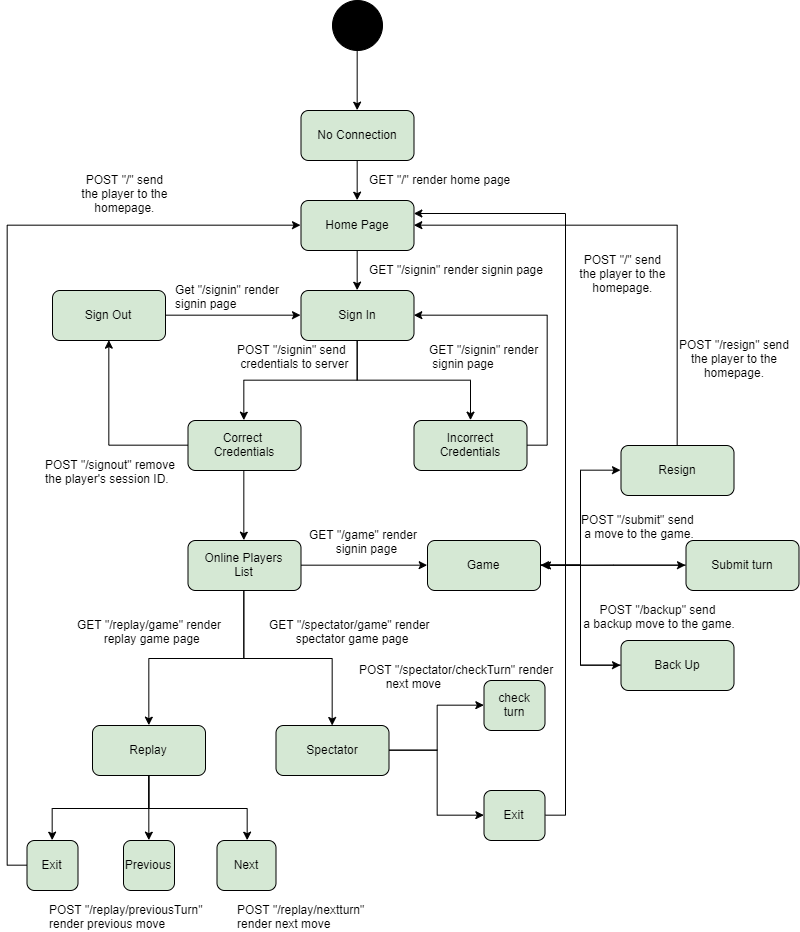

# PROJECT Design Documentation

## Team Information
* Team name: TEAM D - CodeLords
* Team members
  * Bao Nguyen
  * Sidney Mitchell
  * Liam Obrochta
  * John Licitra
  * Angela Hudak

## Executive Summary

A web application to play a checkers game.

The application allows players to play checkers with other players who are currently signed-in. The game user interface (UI)
will support a game experience using drag-and-drop browser capabilities for making moves.

The application allows players to save their games in Replay Mode so that they could watch later on.

The application allows other players to view on-going games that they are not playing through Spectator Mode.

### Purpose
> _Provide a very brief statement about the project and the most
> important user group and user goals._

### Glossary and Acronyms
> _Provide a table of terms and acronyms._

| Term | Definition |
|------|------------|
| VO | Value Object |

## Requirements

This section describes the features of the application.

### Definition of MVP
> _Provide a simple description of the Minimum Viable Product._
- Every player must sign-in before playing a game, and be able to sign-out when finished playing.
- Two players must be able to play a game of checkers based upon the American rules.
- Either player of a game may choose to resign, at any point, which ends the game.

### MVP Features
> _Provide a list of top-level Epics and/or Stories of the MVP._
- Sign In: Allow the player to sign in the page.
- Sign Out: Allow the player to sign out the page.
- Resign: Allow the player to resign a game.
- Play mode: Allow the players to play checkers games.

### Roadmap of Enhancements
> _Provide a list of top-level features in the order you plan to consider them._
- Sign In/ Sign Out.
- Play Mode.
- Resign.
- Spectator Mode.
- Replay Mode.

## Application Domain

This following Domain-model describes the application domain.

## Architecture and Design

This section describes the application architecture.

### Summary

The following Tiers/Layers model shows a high-level view of the webapp's architecture.

As a web application, the user interacts with the system using a
browser.  The client-side of the UI is composed of HTML pages with
some minimal CSS for styling the page.  There is also some JavaScript
that has been provided to the team by the architect.

The server-side tiers include the UI Tier that is composed of UI Controllers and Views.
Controllers are built using the Spark framework and View are built using the FreeMarker framework.  The Application and Model tiers are built using plain-old Java objects (POJOs).

Details of the components within these tiers are supplied below.

### Overview of User Interface

This section describes the web interface flow; this is how the user views and interacts
with the WebCheckers application.

### UI Tier
> _Provide a summary of the Server-side UI tier of your architecture.
> Describe the types of components in the tier and describe their
> responsibilities.  This should be a narrative description, i.e. it has
> a flow or "story line" that the reader can follow._

> _At appropriate places as part of this narrative provide one or more
> static models (UML class structure or object diagrams) with some
> details such as critical attributes and methods._

> _You must also provide any dynamic models, such as statechart and
> sequence diagrams, as is relevant to a particular aspect of the design
> that you are describing.  For example, in WebCheckers you might create
> a sequence diagram of the `POST /validateMove` HTTP request processing
> or you might show a statechart diagram if the Game component uses a
> state machine to manage the game._

> _If a dynamic model, such as a statechart describes a feature that is
> not mostly in this tier and cuts across multiple tiers, you can
> consider placing the narrative description of that feature in a
> separate section for describing significant features. Place this after
> you describe the design of the three tiers._

- Sign In/ Sign Out:
    + When a user first search for the web page, a GET "/" HTTP response is called to render the home page.
    Then if the user is not signed in, he could only see the numbers of players online. When the user clicked sign in, the
    GET HTTP "/signin" response is called to take him to the sign in page. If the sign in username already exists, a GET "/signin" HTTP response is called and he will be taken to the sign in page
    again. Otherwise, he would be taken into the home page and see all available players. After that, he could decide to stay or log out the game.
    If he chooses to log out, the player will be redirect to the sign in page again.
- Resign:
    + When a player wants to leave a game, he could clicked the RESIGN button on the controller bar. A POST "/resign" HTTP response is called and he will be taken to the home page.

### Application Tier
> _Provide a summary of the Application tier of your architecture. This
> section will follow the same instructions that are given for the UI
> Tier above._
- GameServer:
    + Store all the in-progress games and current active players.
- PlayerLobby:
    + When a player sign in the game, the PlayerLobby is called to add the player to the game server. 
    + When a player sign out the game, the PlayerLobby is called to remove the player from the game server.
    + When a player joins a game, the PlayerLobby is called to add the game to the game server.
    + When a player resign from a game, the PlayerLobby is called to remove the game from the game server.
### Model Tier
> _Provide a summary of the Application tier of your architecture. This
> section will follow the same instructions that are given for the UI
> Tier above._
- Contains all the Checkers game logic.
- Contains Game and Player objects and their functions.

### Design Improvements
> _Discuss design improvements that you would make if the project were
> to continue. These improvement should be based on your direct
> analysis of where there are problems in the code base which could be
> addressed with design changes, and describe those suggested design
> improvements. After completion of the Code metrics exercise, you
> will also discuss the resutling metric measurements.  Indicate the
> hot spots the metrics identified in your code base, and your
> suggested design improvements to address those hot spots._
- Create some helpers function in as utils to handle HTTP request.

## Testing

- Run the website as normal to check if it is working.
- Write unit testings to test UI, Model and Application components and see whether they are fully functional.

### Acceptance Testing
> _Report on the number of user stories that have passed all their
> acceptance criteria tests, the number that have some acceptance
> criteria tests failing, and the number of user stories that
> have not had any testing yet. Highlight the issues found during
> acceptance testing and if there are any concerns._
- Sign In/ Sign Out and Resign have passed all their acceptance criteria. 

### Unit Testing and Code Coverage
> _Discuss your unit testing strategy. Report on the code coverage
> achieved from unit testing of the code base. Discuss the team's
> coverage targets, why you selected those values, and how well your
> code coverage met your targets. If there are any anomalies, discuss
> those._
- Write uniting test for each class. 
- Test the model before testing the UI since the logic needs to be working before being reflected through the UI.